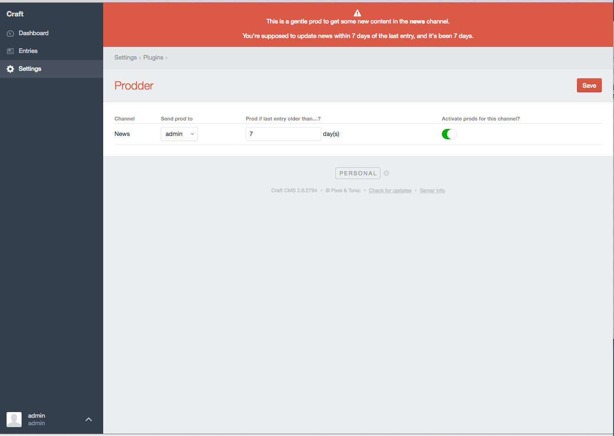

# Prodder plugin for Craft CMS

This plugin gives you a friendly alert about stagnating channels.

## Installation

To install Prodder, follow these steps:

1. Download & unzip the file and place the `prodder` directory into your `craft/plugins` directory
2.  -OR- do a `git clone https://github.com/billythekid/prodder.git` directly into your `craft/plugins` folder.  You can then update it with `git pull`
3. Install plugin in the Craft Control Panel under Settings > Plugins
4. The plugin folder should be named `prodder` for Craft to see it.  GitHub recently started appending `-master` (the branch name) to the name of the folder for zip file downloads.

Prodder works on Craft 2.4.x and Craft 2.5.x.

## Prodder Overview

Prodder is designed to give you a slightly annoying but not too intrusive warning that your content isn't as fresh as you'd like it.
Content is king right? Nobody wants a smelly old king. We like out kings fragrant and fresh.

Prodder also sends the user selected to look after a channel a daily email prod if they've not updated it.

## Configuring Prodder

Click on Prodder's settings button from the plugin installation page or from the settings page (2.5+). In here you will see any channels listed (Prodder only checks channels, no singles or structures) where you can set up your "prod" criteria.
* Send prod to: Select who should see the alert when the channel is overdue an entry.
* Prod if last entry older than…?: Choose the number of days before this channel is considered stale.
* Activate prods for this channel?: Whether to include this channel when checking if you need a prod.

If you are running Craft Client or Craft Pro editions you will be able to modify the email message used by Prodder. Find this in your email settings.
The following variables are available for you in the email message:
* user - This is the user model being sent the email
* channel - The channel handle that's stale.
* days - The number of days that pas before this channel is considered stale.
* difference - The number of days since there was an entry in the channel.

## Using Prodder

Just use the CMS. If prodder sees one of your channels is stale and that you are the person who needs to know that, it'll tell you. It won't go away until you've updated the channel.

## Prodder Roadmap

* Nothing else planned

## Prodder Changelog

### 1.0.2 -- 2016.06.30

* Fixed bug where channels with no valid entries (disabled or whatever) were squawking

### 1.0.1 -- 2016.06.30

* Added email functionality
* Fixed bug where all users were being notified

### 1.0.0 -- 2016.06.29

* Initial release

Brought to you by [Billy Fagan](https://billyfagan.co.uk)